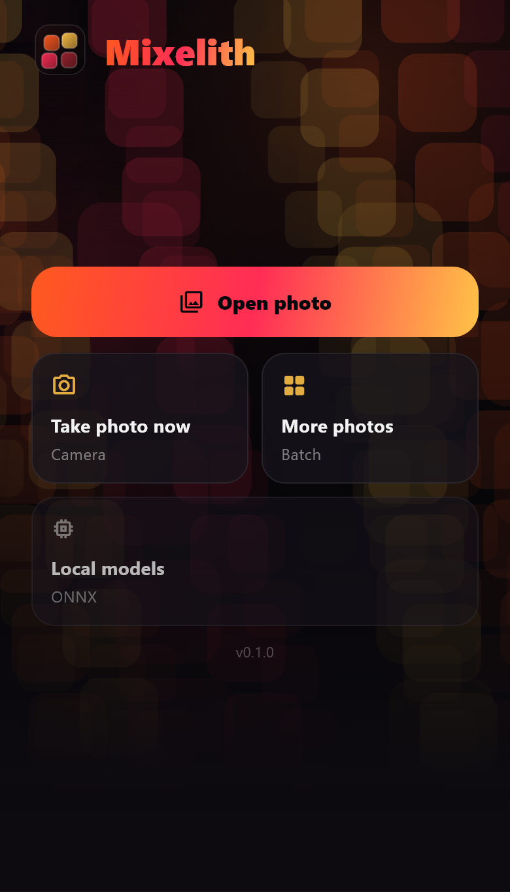
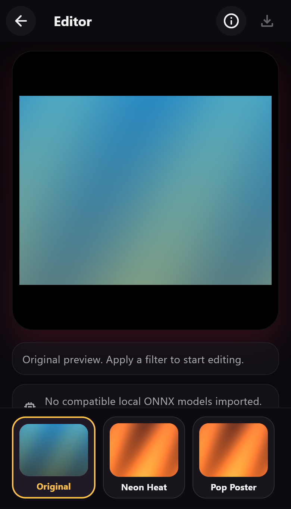
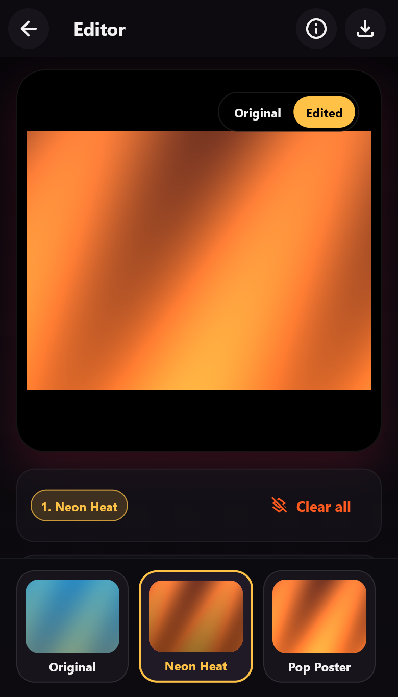
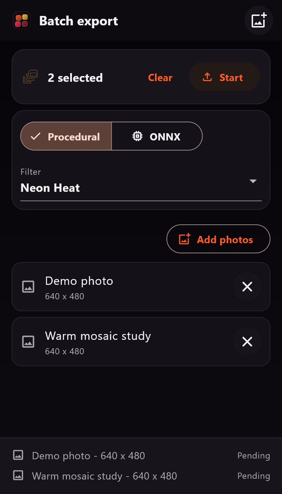
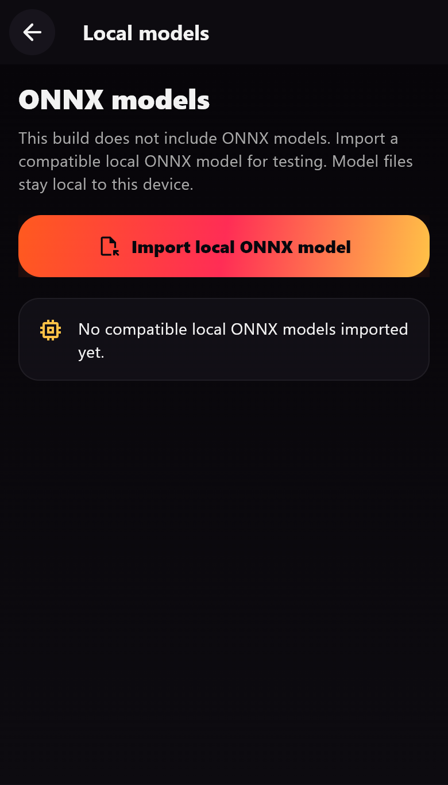

# Mixelith

Mixelith is an offline-first Flutter/Android app for local artistic photo filtering. It combines built-in procedural filters with optional support for user-provided ONNX style models, without accounts, backend services, analytics, ads, or an `android.permission.INTERNET` permission.

## Screenshots

These screenshots use a generated demo image and do not include personal photos or bundled model files.

| Home | Editor: original | Editor: filtered |
| --- | --- | --- |
|  |  |  |

| Batch export | Local ONNX models |
| --- | --- |
|  |  |

## What It Does

Mixelith is an Android-first Flutter photo filtering app focused on local artistic image transformations. It lets you open or capture photos, apply included procedural looks, compare original and edited results, and export JPEG or PNG files back to the device.

The 0.1.0 release also includes local ONNX model import support for compatible user-provided models.

## Features

- Android photo import through the modern Android Photo Picker, with document fallback where needed.
- Camera capture for taking a new photo inside the app.
- Single-image editor with original/edited comparison.
- Procedural filter stack with included artistic presets.
- Batch export flow for applying a selected procedural filter or compatible local ONNX model to multiple photos.
- JPEG and PNG export.
- Re-encoded output files so source image metadata is not carried into exports.
- Local ONNX model management for user-provided compatible models.

## Privacy/Offline Design

- Offline-first.
- No account.
- No backend.
- No analytics.
- No ads.
- No `android.permission.INTERNET`.
- Images stay on the device.
- Imported model files stay local to the device.

## Current Status: 0.1.0

Mixelith 0.1.0 is the first public release. The app is usable for local procedural filters and early local ONNX model testing, but it is not a polished app store build yet.

The validated Android version is `0.1.0+1`, with `versionName` `0.1.0` and `versionCode` `1`.

## Included Procedural Filters

The 0.1.0 release includes procedural filters such as:

- Original
- Neon Heat
- Pop Poster
- Watercolor
- Mosaic
- Starry Oil

These filters are implemented locally in the app and do not require network access.

## Local ONNX Model Support

Mixelith can import compatible local ONNX style-transfer models for on-device testing. The app copies imported models into app-private storage and only uses local files selected by the user.

Current local ONNX support is intentionally cautious:

- No model download feature is included.
- Fixed-size or incompatible models may be rejected.
- Full-photo processing preserves aspect ratio and avoids square cropping, tiling, and upscaling.
- Runtime compatibility depends on the model input/output shape and the Android device.

## What Is Not Included

- No bundled ONNX, ORT, TFLite, PyTorch, or other model binaries.
- No model marketplace or downloader.
- No cloud processing.
- No account system.
- No backend service.
- No analytics or ad SDK.
- No share sheet in the 0.1.0 release.
- No iOS production target in this release.

## Companion Project / Model Pipeline

[Forjyn](https://github.com/massimomazzariol/forjyn) is planned as a companion model-forging lab for training, exporting, and validating project-owned ONNX style models that can be used downstream in apps such as Mixelith.

That companion work is separate from this release. Mixelith 0.1.0 only includes local import and validation surfaces for user-provided compatible ONNX files.

## Tech Stack

- Flutter and Dart.
- Riverpod for app state.
- Android Photo Picker and camera integration.
- CPU procedural image processing.
- Local ONNX Runtime integration for imported model experiments.
- Android-first build and validation flow.

## Architecture Overview

The app is organized by feature area:

```text
lib/
|-- app/        # app shell, theme, providers
|-- core/       # shared utilities
|-- features/   # editor, batch, home, export, ONNX models
|-- filters/    # procedural filters and ONNX processing
|-- media/      # Android media/photo access
|-- shared/     # shared UI widgets
`-- storage/    # app-private cache and file handling
```

Additional design, architecture, and validation notes live in [`docs/`](docs/).

## Public Docs

- [Architecture](docs/ARCHITECTURE.md)
- [Privacy and offline design](docs/PRIVACY_AND_OFFLINE.md)
- [Known limitations](docs/KNOWN_LIMITATIONS.md)
- [Roadmap](docs/ROADMAP.md)
- [Release notes 0.1.0](docs/RELEASE_NOTES_0.1.0.md)
- [Third-party licenses and attribution](docs/THIRD_PARTY_LICENSES.md)

## Android Permissions

The Android release is designed with a small permission surface:

- `android.permission.CAMERA` is used for camera capture.
- `android.permission.INTERNET` is intentionally absent.
- Audio, location, network state, and legacy external storage write permissions are intentionally absent.
- Android media read permissions may be declared by platform media dependencies for compatibility across Android versions.

Photo import is routed through Android picker/document APIs, and exported files are written through local Android media APIs.

## Build Instructions

Install Flutter and the Android SDK, then run:

```bash
flutter pub get
flutter analyze
flutter test
flutter build apk --release
```

To run on a connected Android device or emulator:

```bash
flutter run -d <android-device-id>
```

The release APK is produced at:

```text
build/app/outputs/flutter-apk/app-release.apk
```

## Known Limitations

- The release is Android-first; other platforms are development targets only.
- Local ONNX model compatibility is still experimental and depends on model shape/runtime behavior.
- Batch export is intentionally simple in the 0.1.0 release.
- No ONNX model training/export tooling is included in this repository.
- No app store packaging is included in this release.

## Roadmap

- Improve procedural filter quality and calibration on varied real photos.
- Expand compatibility notes for local ONNX style models.
- Refine batch export and repeat-workflow controls.
- Improve editor polish, comparison tools, and filter management.

## License

Released under the MIT License. See [LICENSE](LICENSE).

## Attribution

Third-party package and dependency notes are tracked in [`docs/THIRD_PARTY_LICENSES.md`](docs/THIRD_PARTY_LICENSES.md).
