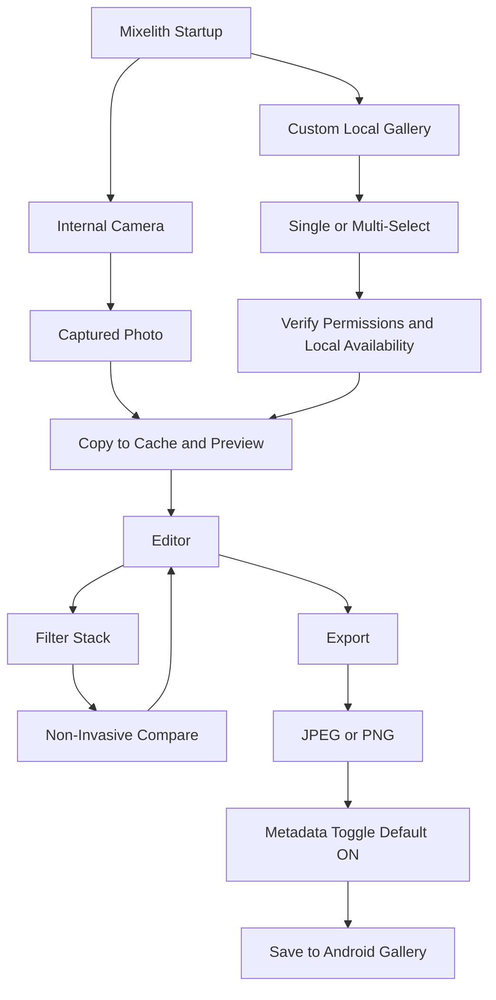

# Product Specification: Mixelith

Mixelith is an artistic, minimal, and entirely local photo editor for Android. The **0.1.0 stable** milestone must allow users to take or open photos, apply stacked artistic filters, compare original and modified views non-invasively, and export JPEG/PNG with explicit control over metadata.

## Project Identity

- Product Name: **Mixelith**.
- Flutter Project Name: `mixelith`.
- Android Package/applicationId: `com.mixelith`.
- GitHub Repository: `https://github.com/massimomazzariol/Mixelith.git`.
- 0.1.0 Product Target: Android.
- Windows Target: Development preview, not product distribution.

## Core Promise

Mixelith transforms personal photos into geometric and abstract artistic compositions while keeping processing entirely on the device. No images, metadata, or usage information should ever leave the phone.

Mixelith does not promise to bypass automated moderation systems, platform policies, or external publishing rules.

## Target Audience

- Privacy-conscious users who want to edit photos without cloud processing.
- Creatives interested in heavy graphic effects: neon, watercolor, mosaic, painterly, and posterization.
- Users who want to work offline, including in airplane mode or in areas with no signal.

## Privacy Constraints

1. **No network:** No HTTP/DNS calls at runtime and no `android.permission.INTERNET` permission.
2. **No backend:** No servers, remote databases, cloud storage, or Firebase services.
3. **No login:** No accounts, OAuth, email, or phone number requirements.
4. **No analytics:** No telemetry, remote crash logging, or tracking SDKs.
5. **No ads:** No advertising SDKs.
6. **Local storage only:** Temporary files only stored in local internal cache.
7. **Metadata control:** Original metadata removal remains default ON; the app must not pretend to preserve EXIF if preservation is not implemented.

## Definition of 0.1.0 Stable

0.1.0 stable is not just the already-validated technical MVP. To be considered stable, the version must include:

- Android as the product target.
- Windows only as a development preview.
- **Real photo capture** with a camera screen controlled by and consistent with the Mixelith UI.
- **Open photo** from the custom gallery.
- **More photos** as a defined, functioning flow, not a placeholder button.
- Editor with an ordered **filter stack**.
- A **Clear all filters** button to empty the stack in one tap.
- Filters with understandable previews/results calibrated on real photos.
- Non-invasive original/modified comparison via a toggle or simple swipe.
- JPEG/PNG export to the gallery.
- A discrete metadata/EXIF toggle in the export bottom sheet.
- No backend, login, tracking, ads, Firebase, machine learning, or `android.permission.INTERNET`.

## Camera

`Take photo` is a mandatory requirement for 0.1.0 and is implemented using the official Flutter `camera` package and an internal camera screen. This feature makes `android.permission.CAMERA` an expected permission on Android.

Camera constraints:

- Do not use video.
- Do not request `android.permission.RECORD_AUDIO`.
- Do not introduce network, uploads, cloud, or remote analysis.
- Do not use `image_picker` as the main shortcut unless a new explicit decision is made.
- Do not automatically save the original shot to the gallery: the shot goes into the cache first and then into the editor.

## More Photos

For 0.1.0, `More photos` must be a real flow. Scope decisions:

- Multi-select from the custom gallery.
- Application of the same filter stack to multiple photos.
- Multiple export to the gallery.
- No advanced batch processing with complex presets.
- No photo reordering.
- No advanced individual editing for batch items in 0.1.0.

If the full implementation proves too broad, the minimum alternative must be decided explicitly before development. Do not leave `More photos` as an ambiguous button.

## Filter Stack

The filter stack enters the 0.1.0 editor model.

- `EditorState` must support an ordered list of applied filters.
- Each new filter is applied on top of the previous result.
- `Original` shows the base image without the stack.
- `Clear all filters` empties the stack.
- Export uses the full stack.
- Compare compares the original vs. the stack result.
- Individual presets remain available in the filter rail.
- Stack reordering and single-filter removal are future features, not mandatory for 0.1.0.

## Compare

The current compare tool with drag text and a dominant handle is too invasive for 0.1.0.

0.1.0 direction:

- Remove the drag-to-compare helper text.
- Prefer a non-invasive `Original` / `Modified` toggle/icon or a simple swipe gesture on the image.
- Clearly show which version is currently visible.
- Do not take up excessive space in the center.
- Do not affect export logic.

## Metadata Toggle

The long message always visible in the export sheet must be replaced by a discrete control.

Documented decision for 0.1.0:

- Show a `Remove metadata` control in the export bottom sheet.
- Default is ON.
- OFF must not be available until a real strategy for preserving EXIF/metadata exists.
- Brief microcopy: the exported file is re-encoded and does not copy original metadata.
- Do not promise metadata preservation until it is implemented and tested.

## Limited Photo Access

Limited photo access remains circumscribed in 0.1.0: if Android grants limited access but the media backend returns no assets, Mixelith displays a dedicated UX guiding the user toward full access. True integration of the Android Photo Picker remains a future task.

## Out of Scope for 0.1.0

- iOS, web, Linux, and macOS as product targets.
- Share sheet or internal social sharing.
- Advanced batch processing.
- Stack reordering or single-filter removal from the stack.
- Full parameter sliders.
- Machine learning.
- Text editors, stickers, collages, or advanced cropping.
- Paywalls, in-app purchases, accounts, or cloud features.

## User Flow 0.1.0

## User Stories

### US1: Custom Gallery Navigation

As a Mixelith user, I want to browse my local photos in an integrated gallery so that I can quickly select an image without relying on a generic system picker.

Criteria:

- Images are read via `photo_manager`.
- The grid loads thumbnails lazily.
- Cloud-only assets are detected and handled without crashing.

### US2: Take Photo

As a Mixelith user, I want to take a photo directly in the app so that I can quickly create a base to filter without going through the gallery.

Criteria:

- The camera requires only `android.permission.CAMERA`.
- `RECORD_AUDIO` remains absent.
- The captured photo enters the same cache/editor/export pipeline as imported photos.

### US3: More Photos

As a creative user, I want to select multiple photos and apply the same look so that I can obtain a consistent series without repeating the work manually.

Criteria:

- The gallery supports multi-select.
- The same filter stack is applied to the selected photos.
- Multiple export saves to the gallery.
- Advanced batch processing and photo reordering are out of scope for 0.1.0.

### US4: Filter Stack

As a creative user, I want to apply multiple filters one after another so that I can build a custom look.

Criteria:

- The stack is ordered.
- `Clear all filters` empties the stack.
- Export uses the full stack.
- Reordering and single removal are future features.

### US5: Non-Invasive Compare

As a user, I want to easily switch between the original and modified image without covering the image with invasive controls.

Criteria:

- No drag-comparison helper text.
- Toggle or simple swipe.
- Visible state: original or modified.
- Export remains independent of the compare mode.

### US6: Secure Export

As a privacy-conscious user, I want to export JPEG or PNG without original metadata so that I can manually share a safer file.

Criteria:

- The user chooses JPEG or PNG.
- JPEG quality defaults to 90.
- `Remove metadata` is default ON.
- OFF is unavailable until metadata preservation is implemented.
- The app warns before attempting exports of very large images.
